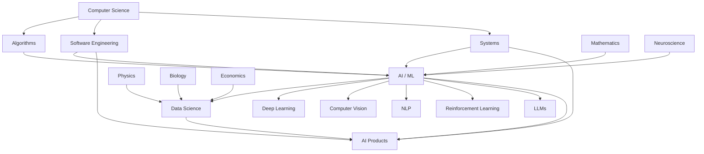

<div align="center">

# `YOUR_GITHUB_USERNAME`

### AI × SOFTWARE ENGINEERING × SCIENCE × EXPERIMENTATION

**I am building myself the same way I build software.**

*Learn something → build something → break it → understand why → measure → improve → repeat.*

<br>

[](https://github.com/YOUR_GITHUB_USERNAME)
[](YOUR_LINKEDIN)
[](YOUR_PORTFOLIO)

</div>

---

# `01 // SYSTEM IDENTITY`

```text
┌──────────────────────────────────────────────────────────────────────┐
│                     PERSONAL ENGINEERING SYSTEM                     │
├──────────────────────────────────────────────────────────────────────┤
│                                                                      │
│  ROLE        →  Computer Science / AI-focused Student & Builder     │
│  ORIGIN      →  Algeria                                              │
│  PRIMARY     →  Artificial Intelligence / Data Science              │
│  SECONDARY   →  Software Engineering                                 │
│  METHOD      →  Learn → Build → Break → Measure → Improve           │
│  CURIOSITY   →  Mathematics + Physics + Biology + Neuroscience      │
│                + Economics + Computer Science                        │
│                                                                      │
│  CURRENT MODE → BUILD                                                │
│                                                                      │
└──────────────────────────────────────────────────────────────────────┘
```

I'm an Algerian computer-science / AI-focused student and builder.

My long-term direction is **AI/ML and Data Science**, but I don't want to become someone who only knows how to call a model API.

I want to understand the layers underneath:

```text
                         ┌──────────────────────┐
                         │      AI / ML         │
                         └──────────┬───────────┘
                                    │
                    ┌───────────────┼───────────────┐
                    ▼               ▼               ▼
              Mathematics      Algorithms       Data
                    │               │               │
                    └───────────────┼───────────────┘
                                    ▼
                           Software Engineering
                                    │
                ┌───────────────────┼──────────────────┐
                ▼                   ▼                  ▼
             Systems             Networks          Deployment
                │                   │                  │
                └───────────────────┼──────────────────┘
                                    ▼
                              Real Products
```

The goal isn't to collect technologies.

The goal is to understand enough of them to **build difficult things**.

---

# `02 // CURRENT MISSION`

> ### Become exceptionally strong at the intersection of **AI, Data, Software Engineering and Scientific Thinking.**

I'm currently building toward a future where I can:

* understand the mathematics behind machine learning
* implement algorithms and models from scratch
* train and evaluate serious models
* work with large and messy datasets
* build production-quality software
* design APIs and systems
* deploy AI applications
* solve difficult algorithmic problems
* connect computation with scientific domains
* experiment rapidly
* turn ideas into working products

Not there yet.

**That's precisely the point of this repository.**

This profile is a record of the journey.

---

# `03 // THE LOOP`

<div align="center">

```text
              ┌─────────────┐
              │    LEARN    │
              └──────┬──────┘
                     ↓
              ┌─────────────┐
              │    BUILD    │
              └──────┬──────┘
                     ↓
              ┌─────────────┐
              │    BREAK    │
              └──────┬──────┘
                     ↓
              ┌─────────────┐
              │   DEBUG     │
              └──────┬──────┘
                     ↓
              ┌─────────────┐
              │   MEASURE   │
              └──────┬──────┘
                     ↓
              ┌─────────────┐
              │   IMPROVE   │
              └──────┬──────┘
                     │
                     └───────────────→ REPEAT
```

</div>

I don't want learning to end at:

> "I understand the tutorial."

I want it to end at:

> **"I can build something with this knowledge."**

---

# `04 // ENGINEERING DOMAINS`

## AI / DATA LAB

| Domain                 | What I'm exploring                                                  |
| ---------------------- | ------------------------------------------------------------------- |
| Machine Learning       | supervised / unsupervised learning, evaluation, feature engineering |
| Deep Learning          | neural architectures, optimization, representation learning         |
| Computer Vision        | image understanding, detection, classification                      |
| NLP                    | text processing, language models, embeddings                        |
| Reinforcement Learning | environments, agents, policies, rewards                             |
| LLMs                   | prompting, applications, evaluation                                 |
| Fine-tuning            | adapting models to specialized tasks                                |
| AI Automation          | agents, workflows, intelligent automation                           |
| Data Science           | analysis, statistics, visualization, experimentation                |
| Kaggle                 | competitions, datasets, modeling practice                           |
| From Scratch           | rebuilding concepts without hiding behind abstractions              |

---

## SOFTWARE ENGINEERING LAB

```text
LANGUAGES
├── Python
├── C++
├── JavaScript
├── TypeScript
└── SQL

WEB
├── HTML / CSS
├── React
├── Next.js
├── Node.js
├── Django
├── Flask
└── FastAPI

SYSTEMS
├── Git
├── Linux
├── Docker
├── Kubernetes
├── DevOps
├── Networking
└── System Design

COMPUTING FOUNDATIONS
├── Algorithms
├── Data Structures
├── Software Architecture
├── Backend Engineering
├── Frontend Engineering
└── Distributed Systems
```

---

# `05 // SCIENCE × COMPUTING`

One of the things I enjoy most is crossing disciplinary boundaries.

```text
                     ┌───────────────┐
                     │ COMPUTER      │
                     │   SCIENCE     │
                     └───────┬───────┘
                             │
        ┌────────────┬───────┼───────┬────────────┐
        ↓            ↓       ↓       ↓            ↓
   MATHEMATICS     PHYSICS  BIOLOGY  ECONOMICS  NEUROSCIENCE
        │            │       │       │            │
        └────────────┴───────┼───────┴────────────┘
                             ↓
                    DATA + MODELS
                             ↓
                     COMPUTATIONAL
                      EXPERIMENTS
```

Areas I'm particularly interested in:

* **Mathematics** → foundations for ML and optimization
* **Physics** → simulation, modeling and quantitative reasoning
* **Biology** → biological data and computational biology
* **Neuroscience** → understanding biological intelligence
* **Economics** → systems, incentives, prediction and decision-making

The interesting part isn't studying each field independently.

It's discovering **where they intersect**.

---

# `06 // THE LABORATORY`

This GitHub isn't intended to be a collection of tutorial clones.

It is an **engineering laboratory**.

Things I want to build include:

```text
┌───────────────────────────────────────────────────────────────┐
│                       EXPERIMENT TYPES                       │
├───────────────────────────────────────────────────────────────┤
│                                                               │
│  [01] Algorithms from scratch                                │
│  [02] Neural networks from scratch                           │
│  [03] Machine-learning experiments                           │
│  [04] Data-science investigations                             │
│  [05] AI applications                                        │
│  [06] Automation systems                                     │
│  [07] APIs and backend systems                               │
│  [08] Full-stack applications                                │
│  [09] Developer tools                                        │
│  [10] Scientific simulations                                 │
│  [11] Visualization experiments                              │
│  [12] Creative coding                                        │
│  [13] Algorithmic challenges                                 │
│  [14] One-day engineering projects                           │
│  [15] Weird ideas that might fail                            │
│                                                               │
└───────────────────────────────────────────────────────────────┘
```

Some experiments will be polished.

Some will be ugly.

Some will fail.

Some will teach me more than successful projects.

**All of them are part of the laboratory.**

---

# `07 // LEARNING AS AN ENGINEERED SYSTEM`

I like measurable progress.

Instead of:

```text
"Learning Machine Learning"
```

I prefer:

```text
Machine Learning
├── hours invested
├── concepts understood
├── algorithms implemented
├── exercises solved
├── datasets explored
├── models trained
├── experiments conducted
├── papers studied
├── competitions entered
├── projects completed
└── systems deployed
```

### Progress is telemetry.

| Metric         | Meaning                                |
| -------------- | -------------------------------------- |
| `HOURS`        | Time invested                          |
| `PROJECTS`     | Things actually built                  |
| `PROBLEMS`     | Problems solved                        |
| `ALGORITHMS`   | Algorithms implemented                 |
| `MODELS`       | Models trained                         |
| `DATASETS`     | Datasets explored                      |
| `PAPERS`       | Papers studied                         |
| `COMPETITIONS` | Competitive experiments                |
| `DEPLOYMENTS`  | Projects exposed to real users/systems |
| `EXPERIMENTS`  | Hypotheses tested                      |

The numbers are not the destination.

They are **feedback signals**.

---

# `08 // PERSONAL PROGRESSION DASHBOARD`

> **This section is intentionally designed to be updated over time.**

### Current development map

| Area                 | Direction                   | Status      |
| -------------------- | --------------------------- | ----------- |
| AI / ML              | Primary specialization      | `BUILDING`  |
| Data Science         | Primary specialization      | `BUILDING`  |
| Python               | Core language               | `BUILDING`  |
| Algorithms & DS      | CS foundation               | `BUILDING`  |
| Backend              | Engineering foundation      | `BUILDING`  |
| Frontend             | Product-building capability | `BUILDING`  |
| Systems / DevOps     | Infrastructure foundation   | `EXPLORING` |
| Mathematics          | ML foundation               | `BUILDING`  |
| Scientific Computing | Cross-disciplinary          | `EXPLORING` |
| Motion Graphics      | Creative engineering        | `EXPLORING` |
| Spanish              | Language                    | `BUILDING`  |
| Chess                | Strategic thinking          | `BUILDING`  |

### Personal operating principle

```text
QUALITY OF WORK
       ×
CONSISTENCY
       ×
CURIOSITY
       ×
DEPTH
       ↓
LONG-TERM COMPOUNDING
```

I care less about looking impressive today than becoming difficult to stop tomorrow.

---

# `09 // LEARNING ARCHITECTURE`

My learning system can be viewed as four layers:

```text
                 ┌─────────────────────────┐
                 │       APPLICATION       │
                 │                         │
                 │   Products / Systems    │
                 └────────────┬────────────┘
                              │
                 ┌────────────▼────────────┐
                 │       ENGINEERING       │
                 │                         │
                 │ APIs / Systems / DevOps │
                 └────────────┬────────────┘
                              │
                 ┌────────────▼────────────┐
                 │       INTELLIGENCE      │
                 │                         │
                 │ ML / DL / AI / Data     │
                 └────────────┬────────────┘
                              │
                 ┌────────────▼────────────┐
                 │       FOUNDATIONS       │
                 │                         │
                 │ Math / Algorithms / CS  │
                 └─────────────────────────┘
```

The objective is not to stay forever at one layer.

It's to move **up and down the stack**.

When a model doesn't work:

> go deeper.

When theory becomes abstract:

> build something.

When a system breaks:

> understand the system.

When something works:

> measure it.

---

# `10 // PROJECT ARCHITECTURE`

I want my repositories to progressively move through this spectrum:

```text
                COMPLEXITY
                   ↑
                   │
        ┌──────────┴──────────┐
        │   LARGE SYSTEMS     │
        ├─────────────────────┤
        │   AI APPLICATIONS   │
        ├─────────────────────┤
        │   DATA PRODUCTS     │
        ├─────────────────────┤
        │   FULL-STACK APPS   │
        ├─────────────────────┤
        │   AI EXPERIMENTS    │
        ├─────────────────────┤
        │   ALGORITHMS        │
        ├─────────────────────┤
        │   SMALL EXPERIMENTS │
        └─────────────────────┘
                   │
                   └────────────→ TIME
```

I want visitors to be able to look through my repositories and see the **difficulty curve**.

Not just what I know.

But how I'm growing.

---

# `11 // PROJECT UNIVERSE`

My ideal project portfolio covers several dimensions:

| Dimension       | Example projects                               |
| --------------- | ---------------------------------------------- |
| 🧠 AI           | ML systems, neural networks, LLM applications  |
| 📊 Data         | analysis, prediction, visualization, pipelines |
| ⚙️ Engineering  | APIs, services, backend systems                |
| 🖥️ Product     | full-stack applications                        |
| 🔬 Science      | simulations and computational experiments      |
| 🧩 Algorithms   | data structures and algorithms                 |
| 🤖 Automation   | intelligent workflows and developer tools      |
| 🎨 Creative     | GSAP, motion graphics, creative coding         |
| 🧪 Experimental | unusual ideas and prototypes                   |

---

# `12 // PROJECT SPOTLIGHT — SKILLFORGE`

One idea that represents how I think about learning:

## `SkillForge`

A skill-tracking application built around one simple idea:

> **Learning itself can be engineered.**

Instead of simply writing:

```text
"I've been learning AI."
```

SkillForge treats a skill as a measurable system:

```text
SKILL
│
├── Name
├── Category
├── Target Hours
├── Current Hours
├── Priority
├── Difficulty
├── Description
├── Notes
└── Statistics
```

The concept is a premium AI-oriented Android application where every skill has its own timer, progression data and statistics.

Example:

```text
┌──────────────────────────────────────┐
│             SKILLFORGE               │
├──────────────────────────────────────┤
│                                      │
│  AI / ML        █████████░░  2037h  │
│  Target                         5000h│
│                                      │
│  Chess          █████░░░░░░   167h  │
│  Target                          300h│
│                                      │
│  Physics        ███░░░░░░░░    91h  │
│  Target                          300h│
│                                      │
│  Marketing      ██░░░░░░░░░    53h  │
│  Target                          300h│
│                                      │
└──────────────────────────────────────┘
```

The project is interesting to me because it connects:

**software engineering + data + UI + productivity + behavioral systems.**

---

# `13 // CURRENT EXPERIMENTS`

This is intended to become a living section.

```text
┌─────────────────────────────────────────────────────────────┐
│                    ACTIVE EXPERIMENTS                       │
├─────────────────────────────────────────────────────────────┤
│                                                             │
│  [ ] BUILD     → YOUR_CURRENT_PROJECT                      │
│  [ ] STUDY     → YOUR_CURRENT_TOPIC                        │
│  [ ] IMPLEMENT → YOUR_CURRENT_ALGORITHM                     │
│  [ ] TEST      → YOUR_CURRENT_HYPOTHESIS                    │
│  [ ] SHIP      → YOUR_CURRENT_DEPLOYMENT                    │
│                                                             │
└─────────────────────────────────────────────────────────────┘
```

### Current research questions

* How far can I push my understanding of ML by implementing components from scratch?
* How can software-engineering practices improve AI experimentation?
* How can scientific concepts become computational projects?
* What does a strong AI engineer actually need to understand?
* How can I turn learning into a measurable feedback system?

---

# `14 // THE CHALLENGE SYSTEM`

I like challenges because they create constraints.

### Challenge types

```text
24H        → Build something in one day
7D         → Build / learn for one week
30D        → Develop a measurable capability
100X       → Repeat a specific task 100 times
FROM-SCRATCH
           → Remove high-level abstractions
REBUILD    → Recreate an existing concept
SHIP       → Turn an experiment into a usable project
```

The purpose isn't to complete arbitrary checklists.

The purpose is to force:

**exposure → repetition → feedback → adaptation.**

---

# `15 // ENGINEERING RULES`

```text
01. Build more than I consume.

02. Understand abstractions instead of blindly trusting them.

03. Read the documentation.

04. Implement difficult concepts from scratch at least once.

05. Treat bugs as information.

06. Measure instead of guessing.

07. Prefer experiments over opinions.

08. Keep projects small enough to finish.

09. Increase complexity gradually.

10. Document what I discover.

11. Revisit fundamentals when advanced systems stop making sense.

12. Ship imperfect things.

13. Make the next project harder than the previous one.

14. Never confuse familiarity with mastery.

15. Keep going.
```

---

# `16 // TECHNOLOGY MAP`

### Languages


### AI / Data


### Web / Engineering


### Creative / Other


---

# `17 // KNOWLEDGE GRAPH`



The long-term objective is to connect these nodes rather than study them as isolated subjects.

---

# `18 // ROADMAP`

```text
FOUNDATIONS
    │
    ├── Mathematics
    ├── Algorithms
    ├── Data Structures
    ├── Programming
    └── Computer Science
            │
            ▼
AI / DATA
    │
    ├── Machine Learning
    ├── Deep Learning
    ├── Computer Vision
    ├── NLP
    ├── Reinforcement Learning
    └── LLMs
            │
            ▼
ENGINEERING
    │
    ├── Backend
    ├── APIs
    ├── Databases
    ├── Systems
    ├── Docker
    ├── Kubernetes
    └── DevOps
            │
            ▼
PRODUCTION
    │
    ├── AI Applications
    ├── Data Products
    ├── Scalable Systems
    └── Real Users
            │
            ▼
RESEARCH / CREATION
    │
    ├── Scientific Computing
    ├── Original Experiments
    ├── Research Questions
    └── Products
```

This isn't a deadline.

It's a **direction**.

---

# `19 // GITHUB TELEMETRY`

<div align="center">


</div>

### Contribution activity

```text
The contribution graph is not just a streak counter.

It is a visual record of:
    → experiments
    → mistakes
    → projects
    → documentation
    → iterations
    → consistency
```

---

# `20 // REPOSITORY PHILOSOPHY`

Every repository should ideally answer at least one question:

> **What did I learn?**

> **What did I build?**

> **What did I discover?**

> **What broke?**

> **How did I improve it?**

A good repository should therefore contain more than source code.

When appropriate, I want projects to include:

```text
README
├── Problem
├── Idea
├── Architecture
├── Implementation
├── Experiments
├── Results
├── What failed
├── What I learned
├── Future improvements
└── Reproducibility
```

Because the repository should tell the **engineering story**, not merely display the final product.

---

# `21 // PROJECT DIFFICULTY CURVE`

One of my long-term goals is to make my GitHub history tell a visible story:

```text
                         ▲
                         │
                         │                         █
                         │                    █    █
                  █      │               █    █    █
             █    █      │          █    █    █    █
        █    █    █      │     █    █    █    █    █
   █    █    █    █      │ █   █    █    █    █    █
───┴────┴────┴────┴──────┴──────────────────────────────→ TIME

 SMALL PROJECTS       EXPERIMENTS       SYSTEMS       SERIOUS PROJECTS
```

The goal isn't for every repository to be impressive.

The goal is for the **trajectory** to be impressive.

---

# `22 // OUTSIDE THE CODE`

I don't want my development to exist in a vacuum.

### Creative

* Motion graphics
* GSAP
* UI / UX
* Figma
* Photoshop
* Creative coding

### Strategic

* Chess
* Problem solving
* Algorithmic thinking

### Physical

* Running
* Swimming
* Calisthenics
* Physical challenges

### Language

* Spanish

These aren't unrelated side quests.

They are different ways of training:

```text
CODE       → precision
SCIENCE    → curiosity
CHESS      → strategy
SPORT      → discipline
ART        → creativity
LANGUAGE   → communication
BUILDING   → execution
```

---

# `23 // WHAT I WANT THIS GITHUB TO BECOME`

Eventually, I want this profile to function almost like a public engineering notebook.

A visitor should be able to trace:

```text
                    WHO I AM
                       │
                       ▼
                WHAT I STUDY
                       │
                       ▼
               WHAT I EXPERIMENT
                       │
                       ▼
                WHAT I BUILD
                       │
                       ▼
              WHAT I MEASURE
                       │
                       ▼
               WHAT I LEARN
                       │
                       ▼
               HOW I IMPROVE
                       │
                       ▼
                 WHERE I GO
```

Not a snapshot.

A trajectory.

---

# `24 // LONG-TERM DIRECTION`

The direction is simple:

```text
                    STUDENT
                       │
                       ▼
                    BUILDER
                       │
                       ▼
                 ENGINEER
                       │
                       ▼
              AI / DATA ENGINEER
                       │
                       ▼
            SYSTEMS + INTELLIGENCE
                       │
                       ▼
              ORIGINAL CREATION
```

I don't expect this progression to be linear.

There will be detours.

There will be failed projects.

There will be technologies I abandon.

There will be periods where progress feels invisible.

That's part of the process.

---

# `25 // THE PRINCIPLE`

<div align="center">

## `I AM NOT TRYING TO LOOK ADVANCED.`

## `I AM TRYING TO BECOME ADVANCED.`

<br>

```text
                 BUILD
                  ↓
                LEARN
                  ↓
                FAIL
                  ↓
               DEBUG
                  ↓
               REBUILD
                  ↓
               MEASURE
                  ↓
               IMPROVE
                  ↓
               REPEAT
                  ↓
              COMPOUND
```

### The repository is the evidence.

### The projects are the experiments.

### The commits are the telemetry.

### The skills are the system.

### The journey is the product.

</div>

---

# `26 // CONTACT`

If you want to discuss AI, software engineering, interesting projects, scientific computing, or strange ideas worth building:

* **GitHub:** `YOUR_GITHUB_USERNAME`
* **Email:** `YOUR_EMAIL`
* **LinkedIn:** `YOUR_LINKEDIN`
* **Portfolio:** `YOUR_PORTFOLIO`

---

<div align="center">

```text
──────────────────────────────────────────────────────────────

             BUILD THE SYSTEM.
             BUILD THE SKILL.
             BUILD THE PERSON.

──────────────────────────────────────────────────────────────
```

**Still building.**

</div>
